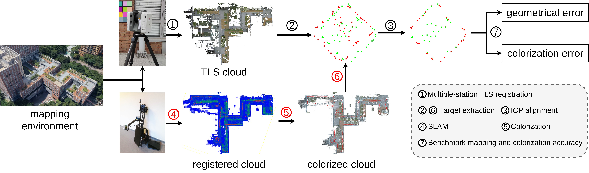
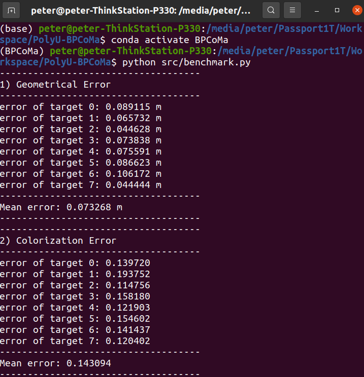

[](https://creativecommons.org/licenses/by-nc-sa/4.0/legalcode)

# PolyU-BPCoMa: A Dataset and Benchmark Towards Mobile Colorized Mapping Using a Backpack Multisensorial System


This repo shares the dataset, sample results, and benchmark devkit used in the paper. 

**PolyU-BPCoMa: A Dataset and Benchmark Towards Mobile Colorized Mapping Using a Backpack Multisensorial System** 

**Authors: Wenzhong Shi, Pengxin Chen, Muyang Wang, Sheng Bao, Haodong Xiang, Yue Yu, Daping Yang**


## 1. Dataset	
The dataset can be downloaded via the following links: \
<a href="https://1drv.ms/u/s!AsE8pm2qeVzXbg6kkX5zuUA1ymo?e=dHZeRK">[OneDrive]</a>

## 2. DevKit	

Fig. 1 shows the benchmark pipeline. To improve the user experience, the steps 1 and 2 in the pipeline has already been completed during dataset preparation. In addition, we provide the code for the step 3 and 7 in this development kits. Therefore, data users will only need to focus on the steps 4, 5 and 6. 

<p align="center">  </p>
<p align="center">Fig 1. Benchmark pipeline </p>

### 2.1 Installation
```angular2html
git clone https://github.com/chenpengxin/PolyU-BPCoMa.git
cd PolyU-BPCoMa
conda env create -f environment.yaml
```

### 2.2 Usage

**1) SLAM and colorization process** 

The first job that data users need to do is to  employ their SLAM (step 4) and colorization (step 5) algorithms on the dataset to generate a colorized point cloud.

**2) Extract color checkers** 

Then, users are required to manually extract target point patches, namely the color checker boards, from their colorized point clouds. 

**3) Compress color checkers** 

Considering that the target point patches usually have a innegligible thickness, we provide the script ```src/target_compress.py``` to compress a thick target patch to a 2D plane.
After cloud compression, users need to extract the four vertex points from each target patches. The [CloudCompare](https://github.com/cloudcompare/cloudcompare) software will help do this. Users may just pick the vertex point in the CloudCompare and save the point coordinate into a text file, and we provide the script ```/src/targetTxt2Csv.py``` to convert the data copied from CloudCompare to the data format that our devkit accepts. 


**4) Establish vertex correspondences** 

Let's call the point cloud generated from a SLAM algorihtm as a MLS cloud, and the ground-truth point cloud as a TLS cloud. Please make sure that the extracted target vertexes form MLS clouds have exact one-to-one correspondence with the target vertexes provided by the TLS clouds. These two group of target point patches and vertexes points should be in the same order. Otherwise, the devkit code would fail.
To facilitate the corrspondence finding, we provide a registered TLS cloud with 1cm voxel downsampling in each data sequence for users' visualization during target extraction work.


**5) Baseline**

We give a sample result in the ```baseline/Area_1/MLS``` folder. 

By running the script 
```angular2html
python src/benchmark.py
```
, the program will start evaluating the mapping accuracy and colorization accuracy.

A quantitative evaluation results is shown as 
Fig. 2. This servers as an example of how to prepare the file structure for evaluation and as a baseline method for comparsion. 

<p align="center">  </p>
<p align="center">Fig 2. Baseline result </p>


### Citation

        @article{chen2022bpcoma,
  	             title={PolyU-BPCoMa: A Dataset and Benchmark Towards Mobile Colorized Mapping Using a Backpack Multisensorial System},
  	             author={Wenzhong Shi, Pengxin Chen, Muyang Wang, Sheng Bao, Haodong Xiang, Yue Yu, Daping Yang},
  	             publisher={arXiv}
                }


### License
Licensed under the CC BY-NC-SA 4.0 license, see [LICENSE](./LICENSE).


### Updates
* May 10, 2022: Initial release.